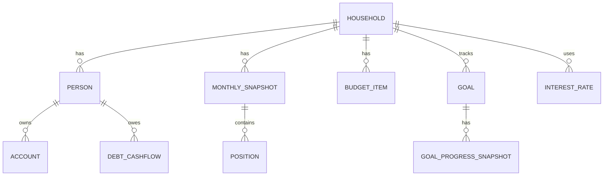

# SPEC: App de Acompanhamento Financeiro Familiar

**Origem analisada:** `Plan_Fin_melhorada_claudeV2.xlsx`  
**Objetivo:** transformar a planilha atual em um app próprio de acompanhamento financeiro mensal, abandonando completamente a estrutura visual de Excel no front-end.  
**Status:** viável. A planilha já está organizada em domínios claros: dashboard, balancetes mensais, orçamento familiar, cronograma de dívidas e metas. O app deve preservar a lógica econômica, mas substituir abas, células e fórmulas por entidades, formulários, gráficos e um motor de cálculo.

---

## 1. Decisão de produto

É possível e recomendável transformar a planilha em um app.

A planilha atual funciona como um protótipo operacional: ela consolida patrimônio líquido, caixa, investimentos, dívidas a valor presente, orçamento mensal, taxa de poupança, reserva de emergência, metas e projeções de crescimento patrimonial. O problema é que a lógica está espalhada em células, fórmulas, intervalos e gráficos dependentes de endereços. Isso torna o controle mensal sujeito a erro de cópia, referências quebradas, fórmulas desatualizadas e dificuldade de evolução.

O app deve trocar a lógica de “preencher células” por uma rotina de **fechamento financeiro mensal**. Todo mês o usuário cria ou revisa um snapshot, informa saldos, dívidas, orçamento e metas, e o sistema recalcula automaticamente os indicadores.

---

## 2. Escopo funcional do MVP

### 2.1 Módulos obrigatórios

1. **Dashboard financeiro**
   - Patrimônio líquido atual.
   - Caixa total.
   - Investimentos totais.
   - Dívidas a valor presente.
   - Variação mensal de PL.
   - Dívida sobre ativos.
   - Meses de reserva.
   - Taxa de poupança.
   - Gráficos de evolução mensal.
   - Metas mais próximas de serem atingidas.

2. **Fechamento mensal**
   - Wizard para inserir dados de um novo mês.
   - Saldos por pessoa e por conta.
   - Selic anual do mês.
   - Revisão de dívidas futuras.
   - Revisão de orçamento.
   - Confirmação dos indicadores calculados.
   - Histórico de revisões.

3. **Balancetes mensais**
   - Histórico mensal de snapshots.
   - Separação Bruno/Tatiane.
   - Caixa, investimentos, cashback, benefícios, dívidas nominais e dívidas a valor presente.
   - Métricas agregadas por mês.

4. **Dívidas e cartão de crédito**
   - Registro de fluxos futuros de parcelas.
   - Cálculo de saldo nominal.
   - Cálculo de valor presente descontado pela Selic.
   - Cálculo de ganho de float.
   - Fatura do mês por pessoa.
   - Resumo consolidado familiar.

5. **Orçamento familiar**
   - Entradas por pessoa.
   - Despesas fixas.
   - Despesas variáveis, especialmente cartão de crédito.
   - Sobra mensal estimada.
   - Sobra anualizada.
   - Comprometimento da renda.
   - Peso do cartão no orçamento.

6. **Metas financeiras e pessoais**
   - Metas de curto, médio e longo prazo.
   - Alvo, valor atual, percentual atingido, prazo e status.
   - Metas quantitativas e qualitativas.
   - Projeções de CAGR necessário para marcos patrimoniais.

7. **Importação inicial da planilha**
   - Importar os dados existentes da planilha apenas como migração inicial.
   - Converter datas seriais do Excel para datas reais.
   - Recalcular métricas no app e reconciliar contra os valores existentes.

### 2.2 Fora do escopo do MVP

- Integração automática com bancos, corretoras ou cartões.
- Open Finance.
- Cadastro detalhado de cada compra do cartão, salvo se for usado para gerar parcelas futuras.
- Planejamento tributário completo.
- Simulação avançada de carteira de investimentos.
- Multi-moeda.
- Multi-família.

Esses itens podem entrar em fases futuras.

---

## 3. Mapeamento da planilha atual para o app

| Aba atual | Função na planilha | Módulo equivalente no app |
|---|---|---|
| `Dashboard` | Painel executivo com KPIs, gráficos e metas próximas | Dashboard financeiro |
| `Balancetes` | Snapshots mensais de caixa, investimentos, dívidas e PL | Fechamento mensal e histórico de balancetes |
| `Entradas_e_Saídas_Mensais` | Orçamento familiar, renda, despesas e sobra | Orçamento familiar |
| `Dívidas` | Matrizes de parcelas futuras por pessoa, PV e float | Dívidas e cartão de crédito |
| `Metas` | Metas, status, progresso e projeção de CAGR | Metas e planejamento patrimonial |

### 3.1 Leitura da estrutura atual

A planilha contém cinco abas principais. A tabela `Balancete` está estruturada em `Balancetes!A3:AB18` e concentra as colunas essenciais de fechamento mensal:

- `Mês`
- `Bru: Nubank`
- `Bru: VR`
- `Bru: VA`
- `Bru: Investimentos`
- `Bru: Cashback`
- `Bru: Dívida (nom.)`
- `Bru: Dívida (PV)`
- `Bru: PL`
- `Tati: Caixa`
- `Tati: Investimentos`
- `Tati: Dívida (nom.)`
- `Tati: Dívida (PV)`
- `Tati: PL`
- `Selic anual`
- `Caixa Total`
- `Invest. Total`
- `Dívida Total (PV)`
- `PL Total`
- `Variação`
- `Variação (%)`
- `Ativos (Cx+Inv)`
- `Dívida / Ativos`
- `Meses Reserva`
- `Tx Poupança`
- `Receita (orç.)`
- `Despesa (orç.)`
- `Var vs Orç.`

O último mês preenchido observado é **maio/2026**, com os seguintes indicadores de referência para teste de migração:

| Indicador | Valor esperado após migração |
|---|---:|
| Patrimônio líquido total | R$ 275.223,18 |
| Caixa total | R$ 184.408,62 |
| Investimentos totais | R$ 140.124,10 |
| Dívida total a valor presente | R$ 49.309,54 |
| Variação mensal do PL | -R$ 16.446,90 |
| Dívida / Ativos | 15,19% |
| Meses de reserva | 4,96 |
| Investimentos / Ativos | 43,18% |
| Taxa de poupança patrimonial | -28,81% |

Esses números devem ser usados como testes de aceitação da importação inicial.

---

## 4. Experiência do usuário

### 4.1 Princípio central

O front-end não deve parecer uma planilha. Tabelas podem existir para auditoria, mas a experiência principal deve ser baseada em:

- Cards de KPI.
- Gráficos interativos.
- Formulários guiados.
- Wizards de fechamento mensal.
- Listas de metas.
- Telas de reconciliação.
- Drill-down por pessoa, conta, mês e indicador.

### 4.2 Navegação principal

1. **Dashboard**
2. **Fechamento mensal**
3. **Balancetes**
4. **Dívidas**
5. **Orçamento**
6. **Metas**
7. **Relatórios**
8. **Configurações**

### 4.3 Dashboard

O dashboard deve abrir no último mês fechado e permitir alternar o mês de referência.

Componentes:

- Header com mês de referência.
- Cards:
  - Patrimônio líquido.
  - Caixa.
  - Investimentos.
  - Dívidas a valor presente.
  - Variação mensal.
  - Taxa de poupança.
- Gráficos:
  - Evolução do patrimônio líquido.
  - Composição patrimonial: caixa, investimentos e dívidas.
  - Variação mensal.
  - Ativos vs dívidas.
  - Dívida / ativos.
  - Meses de reserva.
- Bloco de metas próximas:
  - Nome da meta.
  - Progresso.
  - Valor atual versus alvo.
  - Status.

### 4.4 Wizard de fechamento mensal

Fluxo recomendado:

1. **Selecionar mês**
   - Exemplo: junho/2026.
   - O app sugere o mês seguinte ao último fechado.

2. **Inserir saldos de Bruno**
   - Nubank.
   - VR.
   - VA.
   - Investimentos.
   - Cashback.
   - Outros ativos, se cadastrados.

3. **Inserir saldos de Tatiane**
   - Caixa.
   - Investimentos.
   - Outros ativos, se cadastrados.

4. **Atualizar taxa Selic anual**
   - Manual no MVP.
   - Automática em fase posterior via integração com fonte oficial.

5. **Revisar dívidas do cartão**
   - Parcelas futuras existentes.
   - Novas compras parceladas.
   - Ajustes manuais de fatura.

6. **Revisar orçamento**
   - Renda recorrente.
   - Despesas fixas.
   - Variáveis estimadas.
   - Eventos extraordinários.

7. **Prévia dos indicadores**
   - PL total.
   - Variação mensal.
   - Dívida / ativos.
   - Meses de reserva.
   - Sobra mensal estimada.

8. **Fechar mês**
   - Snapshot fica marcado como fechado.
   - Alterações posteriores geram revisão, não sobrescrevem silenciosamente o histórico.

---

## 5. Modelo de dados

### 5.1 Entidades principais



### 5.2 Tabelas recomendadas

#### `households`

| Campo | Tipo | Observação |
|---|---|---|
| `id` | UUID | PK |
| `name` | text | Exemplo: Família Savastano |
| `base_currency` | text | `BRL` |
| `created_at` | timestamp | Auditoria |
| `updated_at` | timestamp | Auditoria |

#### `persons`

| Campo | Tipo | Observação |
|---|---|---|
| `id` | UUID | PK |
| `household_id` | UUID | FK |
| `name` | text | Bruno, Tatiane |
| `role` | text | owner, spouse, dependent, etc. |
| `created_at` | timestamp | Auditoria |

#### `accounts`

| Campo | Tipo | Observação |
|---|---|---|
| `id` | UUID | PK |
| `person_id` | UUID | FK |
| `name` | text | Nubank, VR, VA, Investimentos, Cashback |
| `account_type` | enum | cash, benefit, investment, cashback, other |
| `is_active` | boolean | Permite manter histórico de contas encerradas |

#### `monthly_snapshots`

| Campo | Tipo | Observação |
|---|---|---|
| `id` | UUID | PK |
| `household_id` | UUID | FK |
| `period_month` | date | Sempre o primeiro dia do mês |
| `status` | enum | draft, closed, revised |
| `selic_annual` | decimal | Taxa anual usada no mês |
| `closed_at` | timestamp | Data de fechamento |
| `revision_number` | integer | Controle de versões |
| `notes` | text | Observações do mês |

#### `positions`

| Campo | Tipo | Observação |
|---|---|---|
| `id` | UUID | PK |
| `snapshot_id` | UUID | FK |
| `person_id` | UUID | FK |
| `account_id` | UUID | FK opcional |
| `category` | enum | cash, benefit, investment, cashback |
| `amount` | decimal | Valor no fim do mês |
| `source` | enum | manual, import, adjustment |

#### `debt_cashflows`

| Campo | Tipo | Observação |
|---|---|---|
| `id` | UUID | PK |
| `household_id` | UUID | FK |
| `person_id` | UUID | FK |
| `card_name` | text | Exemplo: cartão principal |
| `invoice_month` | date | Mês de referência da fatura ou origem da dívida |
| `payment_month` | date | Mês em que a parcela vence |
| `amount` | decimal | Valor da parcela |
| `description` | text | Opcional |
| `source` | enum | manual_matrix, purchase, adjustment, import |
| `created_at` | timestamp | Auditoria |

#### `debt_purchases` opcional

Essa tabela é recomendada para evolução futura. No MVP, `debt_cashflows` é suficiente.

| Campo | Tipo | Observação |
|---|---|---|
| `id` | UUID | PK |
| `person_id` | UUID | FK |
| `purchase_date` | date | Data da compra |
| `merchant` | text | Estabelecimento |
| `total_amount` | decimal | Valor total |
| `installments_count` | integer | Número de parcelas |
| `first_payment_month` | date | Primeiro vencimento |
| `card_name` | text | Cartão usado |

#### `budget_items`

| Campo | Tipo | Observação |
|---|---|---|
| `id` | UUID | PK |
| `household_id` | UUID | FK |
| `person_id` | UUID opcional | Nulo para item familiar |
| `name` | text | Salário, aluguel, plano de saúde, etc. |
| `kind` | enum | income, fixed_expense, variable_expense |
| `amount_monthly` | decimal | Valor mensalizado |
| `recurrence` | enum | monthly, annualized, one_off |
| `start_month` | date | Início de validade |
| `end_month` | date opcional | Fim de validade |
| `is_active` | boolean | Ativo/inativo |

#### `goals`

| Campo | Tipo | Observação |
|---|---|---|
| `id` | UUID | PK |
| `household_id` | UUID | FK |
| `title` | text | Nome da meta |
| `horizon` | enum | short, medium, long |
| `metric_key` | text | Exemplo: net_worth, investment_ratio, debt_to_assets |
| `target_value` | decimal/text | Valor alvo |
| `target_date` | date/text | Prazo ou recorrência |
| `comparison_operator` | enum | greater_or_equal, less_or_equal, equals, manual |
| `risk_cap_value` | decimal opcional | Usado para metas inversas, como dívida/ativos |
| `manual_current_value` | text/decimal opcional | Para metas qualitativas |
| `notes` | text | Observações |

#### `goal_progress_snapshots`

| Campo | Tipo | Observação |
|---|---|---|
| `id` | UUID | PK |
| `goal_id` | UUID | FK |
| `period_month` | date | Mês de referência |
| `current_value` | decimal/text | Valor usado no cálculo |
| `progress_pct` | decimal | 0 a 1, podendo ser negativo para deterioração |
| `status` | enum | achieved, in_progress, attention, long_term |

#### `interest_rates`

| Campo | Tipo | Observação |
|---|---|---|
| `id` | UUID | PK |
| `period_month` | date | Mês da taxa |
| `rate_type` | enum | selic_annual |
| `annual_rate` | decimal | Exemplo: 0,15 para 15% a.a. |
| `source` | enum | manual, external_api |

---

## 6. Motor de cálculo

Todas as fórmulas devem sair das células e virar funções testáveis em uma camada própria, preferencialmente em TypeScript ou Python.

### 6.1 Métricas patrimoniais

```text
caixa_total = soma(posições com category em cash ou benefit)

investimentos_total = soma(posições com category em investment ou cashback)

ativos_total = caixa_total + investimentos_total

divida_total_pv = divida_pv_bruno + divida_pv_tatiane

pl_bruno = ativos_bruno - divida_pv_bruno

pl_tatiane = ativos_tatiane - divida_pv_tatiane

pl_total = pl_bruno + pl_tatiane

variacao_pl = pl_total_mes_atual - pl_total_mes_anterior

variacao_pct = variacao_pl / pl_total_mes_anterior

divida_ativos = divida_total_pv / ativos_total

meses_reserva = caixa_total / despesa_mensal_orcada

investimentos_ativos = investimentos_total / ativos_total
```

### 6.2 Taxa de poupança

A planilha atual usa uma taxa patrimonial baseada na variação do PL:

```text
taxa_poupanca_patrimonial = variacao_pl / receita_mensal_orcada
```

O app deve também calcular uma taxa orçamentária, porque ela é economicamente mais intuitiva para planejamento de fluxo de caixa:

```text
taxa_poupanca_orcamentaria = (receita_mensal_orcada - despesa_mensal_orcada) / receita_mensal_orcada
```

O dashboard pode mostrar as duas, com nomes diferentes:

- **Poupança patrimonial:** quanto o PL variou contra a renda orçada.
- **Poupança orçamentária:** quanto sobra no orçamento recorrente.

### 6.3 Dívidas a valor presente

A planilha calcula o valor presente das parcelas futuras descontando pela Selic anual convertida para taxa mensal.

```text
taxa_mensal = (1 + selic_anual)^(1/12) - 1

meses_ate_pagamento = diferença em meses entre invoice_month e payment_month

valor_presente = soma(amount / (1 + taxa_mensal)^meses_ate_pagamento)

saldo_nominal = soma(amount)

ganho_float = saldo_nominal - valor_presente
```

Regras:

- `invoice_month` representa o mês de referência da fatura ou da dívida projetada.
- `payment_month` representa o vencimento efetivo da parcela.
- Se `payment_month` for igual a `invoice_month`, não há desconto temporal.
- Se `payment_month` for anterior ao mês de referência, o app deve rejeitar o cashflow ou marcar como inconsistência.

### 6.4 Fatura do mês

```text
fatura_do_mes_pessoa = soma(debt_cashflows.amount onde payment_month = period_month e person_id = pessoa)

fatura_do_mes_total = soma(fatura_do_mes_pessoa)
```

### 6.5 Orçamento

```text
receita_mensal_orcada = soma(budget_items.kind = income e item ativo no mês)

despesa_fixa = soma(budget_items.kind = fixed_expense e item ativo no mês)

despesa_variavel_cartao = média móvel das faturas dos últimos 12 meses, por pessoa

despesa_variavel_total = despesa_variavel_cartao + gastos_extras

despesa_mensal_orcada = despesa_fixa + despesa_variavel_total

sobra_mensal_estimada = receita_mensal_orcada - despesa_mensal_orcada

sobra_anualizada = sobra_mensal_estimada * 12

comprometimento_renda = despesa_mensal_orcada / receita_mensal_orcada
```

### 6.6 Metas

#### Meta em que maior é melhor

```text
progresso = min(valor_atual / alvo, 1)
```

Exemplos:

- Patrimônio líquido maior que R$ 500 mil.
- Investimentos maiores que R$ 200 mil.
- Renda passiva maior que R$ 5 mil/mês.

#### Meta em que menor é melhor

```text
se valor_atual <= alvo:
    progresso = 1
senão:
    progresso = max(0, 1 - (valor_atual - alvo) / (risk_cap - alvo))
```

Exemplo:

- Dívida/ativos menor que 10%, com `risk_cap` sugerido de 20%.

#### Meta qualitativa

Metas como CFA, cargo, fundação de hedge fund e holding familiar devem ser manuais, com enum ou checklist.

Exemplo:

```text
CFA Level II:
- Não iniciado: 0%
- Estudando: 33%
- Aprovado: 100%
```

### 6.7 Projeção de CAGR necessário

```text
anos_restantes = ano_alvo - ano_referencia

multiplo_total = pl_alvo / pl_atual

cagr_necessario = (pl_alvo / pl_atual)^(1 / anos_restantes) - 1
```

---

## 7. APIs

### 7.1 Dashboard

```http
GET /api/dashboard?period_month=2026-05
```

Resposta:

```json
{
  "periodMonth": "2026-05-01",
  "kpis": {
    "netWorth": 275223.18,
    "cashTotal": 184408.62,
    "investmentsTotal": 140124.10,
    "debtPvTotal": 49309.54,
    "monthlyVariation": -16446.90,
    "debtToAssets": 0.1519,
    "reserveMonths": 4.96,
    "patrimonialSavingsRate": -0.2881
  },
  "charts": {
    "netWorthEvolution": [],
    "assetComposition": [],
    "monthlyVariation": [],
    "assetsVsDebt": [],
    "debtToAssets": [],
    "reserveMonths": []
  },
  "closestGoals": []
}
```

### 7.2 Fechamento mensal

```http
POST /api/monthly-snapshots
GET /api/monthly-snapshots
GET /api/monthly-snapshots/{id}
PATCH /api/monthly-snapshots/{id}
POST /api/monthly-snapshots/{id}/close
POST /api/monthly-snapshots/{id}/revise
```

### 7.3 Posições

```http
POST /api/monthly-snapshots/{id}/positions
PUT /api/monthly-snapshots/{id}/positions/{positionId}
DELETE /api/monthly-snapshots/{id}/positions/{positionId}
```

### 7.4 Dívidas

```http
GET /api/debts?period_month=2026-05
POST /api/debt-cashflows
PUT /api/debt-cashflows/{id}
DELETE /api/debt-cashflows/{id}
GET /api/debts/summary?period_month=2026-05
```

### 7.5 Orçamento

```http
GET /api/budget?period_month=2026-05
POST /api/budget-items
PUT /api/budget-items/{id}
DELETE /api/budget-items/{id}
```

### 7.6 Metas

```http
GET /api/goals?period_month=2026-05
POST /api/goals
PUT /api/goals/{id}
DELETE /api/goals/{id}
POST /api/goals/{id}/manual-progress
```

### 7.7 Importação

```http
POST /api/import/excel
GET /api/import/{importJobId}/status
GET /api/import/{importJobId}/reconciliation
```

---

## 8. Arquitetura recomendada

### 8.1 Stack sugerido para MVP

- **Front-end:** Next.js + React + TypeScript.
- **UI:** Tailwind CSS + shadcn/ui ou equivalente.
- **Gráficos:** Recharts, ECharts ou Tremor.
- **Back-end:** Next.js API Routes, NestJS ou FastAPI.
- **Banco:** PostgreSQL.
- **ORM:** Prisma, Drizzle ou SQLAlchemy.
- **Autenticação:** Auth.js, Clerk, Supabase Auth ou Cognito.
- **Deploy:** Vercel para front-end e API leve; Railway/Fly.io/Supabase para Postgres.
- **Cálculos:** pacote separado `financial-calculations`, testado independentemente.

### 8.2 Separação de camadas

```text
app/
  web/
    dashboard/
    monthly-close/
    debts/
    budget/
    goals/
  api/
    controllers/
    services/
    repositories/
  packages/
    financial-calculations/
    shared-types/
```

### 8.3 Princípios arquiteturais

- O front-end não calcula valores finais críticos. Ele apenas exibe prévias e chama o motor de cálculo.
- O back-end recalcula todos os indicadores antes de fechar um mês.
- Snapshots fechados são imutáveis por padrão.
- Correções geram nova revisão.
- Fórmulas devem ter testes unitários.
- Valores monetários devem usar decimal fixo, não floating point binário.
- Todas as datas mensais devem ser armazenadas como o primeiro dia do mês.

---

## 9. Importação da planilha

### 9.1 Estratégia

A planilha deve ser usada como fonte de migração, não como dependência permanente.

Passos:

1. Ler abas existentes.
2. Converter datas seriais do Excel para `YYYY-MM-01`.
3. Criar household e pessoas.
4. Criar contas com base nas colunas do balancete.
5. Importar snapshots mensais.
6. Importar fluxos de dívida por pessoa.
7. Importar orçamento recorrente.
8. Importar metas.
9. Recalcular métricas no app.
10. Rodar reconciliação contra os KPIs da planilha.

### 9.2 Regras de reconciliação

Para cada mês migrado:

```text
caixa_total calculado == Caixa Total da planilha
investimentos_total calculado == Invest. Total da planilha
divida_total_pv calculada == Dívida Total (PV) da planilha
pl_total calculado == PL Total da planilha
ativos_total calculado == Ativos (Cx+Inv) da planilha
divida_ativos calculado == Dívida / Ativos da planilha
meses_reserva calculado == Meses Reserva da planilha
```

Tolerância recomendada:

- Valores monetários: R$ 0,01.
- Percentuais: 0,01 ponto percentual.

### 9.3 Pontos de atenção na migração

- A planilha usa fórmulas com referências de células e intervalos. O app não deve copiar fórmulas literalmente.
- Algumas metas qualitativas parecem misturar valor patrimonial com status textual. Na migração, metas qualitativas devem ser revisadas manualmente.
- A matriz de dívidas deve ser normalizada em fluxos (`invoice_month`, `payment_month`, `amount`).
- A média de fatura de cartão deve virar uma regra explícita, preferencialmente média móvel de 12 meses.
- Campos manuais e campos calculados precisam ser separados. O usuário deve saber exatamente o que foi digitado e o que foi calculado.

---

## 10. Design visual

A identidade visual da planilha pode ser preservada sem manter a estrutura de Excel.

Direção sugerida:

- Tema escuro, com fundo navy/preto.
- Cards com alto contraste.
- Cores de destaque:
  - Ciano para caixa e evolução positiva.
  - Verde para investimentos e metas atingidas.
  - Magenta/vermelho para dívida e atenção.
  - Laranja para reserva e indicadores de cautela.
- Tipografia limpa e legível.
- Gráficos com tooltips e seleção de período.
- Modo mobile com cards empilhados.

---

## 11. Requisitos não funcionais

### 11.1 Segurança

- Autenticação obrigatória.
- Criptografia em trânsito.
- Backups automáticos do banco.
- Controle de sessão.
- Logs de alterações em valores críticos.
- Possibilidade de exportar backup dos dados.

### 11.2 Auditoria

Cada alteração deve registrar:

- Usuário.
- Timestamp.
- Entidade alterada.
- Valor anterior.
- Valor novo.
- Motivo opcional.

### 11.3 Performance

- Dashboard deve carregar em menos de 2 segundos para histórico de até 10 anos.
- Cálculos mensais devem ser instantâneos para o volume esperado.
- Não há necessidade de arquitetura distribuída no MVP.

### 11.4 Confiabilidade

- Cálculos críticos cobertos por testes unitários.
- Recalcular métricas em fechamento e revisão.
- Bloquear fechamento se houver inconsistências materiais.

---

## 12. Testes de aceitação

### 12.1 Importação

- Dado o arquivo atual, o app importa todos os meses preenchidos em `Balancetes`.
- Dado o mês maio/2026, o app calcula PL total de R$ 275.223,18.
- Dado o mês maio/2026, o app calcula dívida total a valor presente de R$ 49.309,54.
- Dado o mês maio/2026, o app calcula dívida/ativos de aproximadamente 15,19%.
- Dado o mês maio/2026, o app calcula 4,96 meses de reserva.

### 12.2 Fechamento mensal

- O usuário consegue criar um novo mês a partir do último fechado.
- O app pré-preenche estrutura de contas e orçamento.
- O usuário consegue informar saldos por pessoa.
- O app calcula os indicadores antes do fechamento.
- Ao fechar o mês, o dashboard passa a usar o novo mês como referência.

### 12.3 Dívidas

- O usuário consegue adicionar parcela futura para Bruno ou Tatiane.
- O app calcula saldo nominal, valor presente e ganho de float.
- O app calcula fatura do mês por pessoa.
- O app consolida fatura familiar.

### 12.4 Metas

- O app exibe metas por horizonte.
- O app calcula progresso de metas quantitativas.
- O app permite atualizar metas qualitativas manualmente.
- O dashboard exibe as três metas de curto prazo mais próximas de serem atingidas.

### 12.5 Orçamento

- O app calcula renda total, despesas fixas, despesas variáveis e sobra mensal.
- O app calcula comprometimento da renda.
- O app calcula taxa de poupança orçamentária.
- O app calcula peso do cartão no orçamento.

---

## 13. Roadmap

### Fase 0: Migração e validação

- Criar modelo de dados.
- Importar planilha atual.
- Implementar motor de cálculo.
- Reconciliar métricas históricas.

### Fase 1: MVP utilizável

- Dashboard.
- Fechamento mensal.
- Balancetes.
- Dívidas.
- Orçamento.
- Metas.
- Exportação de backup.

### Fase 2: Qualidade de vida

- Cadastro de compras parceladas com geração automática de cashflows.
- Alertas de dívida/ativos.
- Alertas de reserva de emergência.
- Comparativo real versus orçamento.
- Comentários por mês.
- Upload de comprovantes.

### Fase 3: Automação

- Integração com fonte oficial da Selic.
- Integração Open Finance.
- Importação de extratos.
- Reconciliação automática.
- Notificações mensais de fechamento.

### Fase 4: Planejamento avançado

- Simulador de patrimônio.
- Projeções por CAGR, aportes e retorno esperado.
- Cenários de renda, despesa e alavancagem.
- Painel de independência financeira.
- Gestão de holding familiar e estrutura patrimonial.

---

## 14. Decisões em aberto

1. O app será apenas pessoal/familiar ou multiusuário desde o início?
2. As dívidas serão cadastradas por compra ou diretamente por fluxo de parcelas?
3. A taxa de poupança principal do dashboard deve ser patrimonial, orçamentária ou ambas?
4. Metas qualitativas terão checklist fechado ou texto livre?
5. O orçamento será mensal fixo ou com variações por mês?
6. O histórico fechado poderá ser editado diretamente ou apenas por revisão?
7. O MVP precisa de versão mobile nativa ou web responsiva basta?

---

## 15. Conclusão

A planilha está madura o suficiente para virar app. O melhor caminho não é reproduzir o Excel na web, mas transformar cada aba em um módulo de domínio e cada fórmula em uma função testável. O MVP deve começar com importação, fechamento mensal, dashboard, dívidas, orçamento e metas. Depois, o app pode evoluir para automação bancária, simulações patrimoniais e planejamento de longo prazo.
